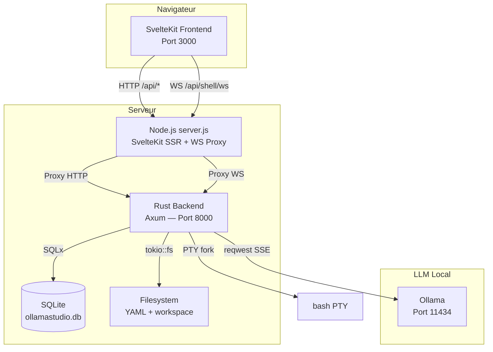
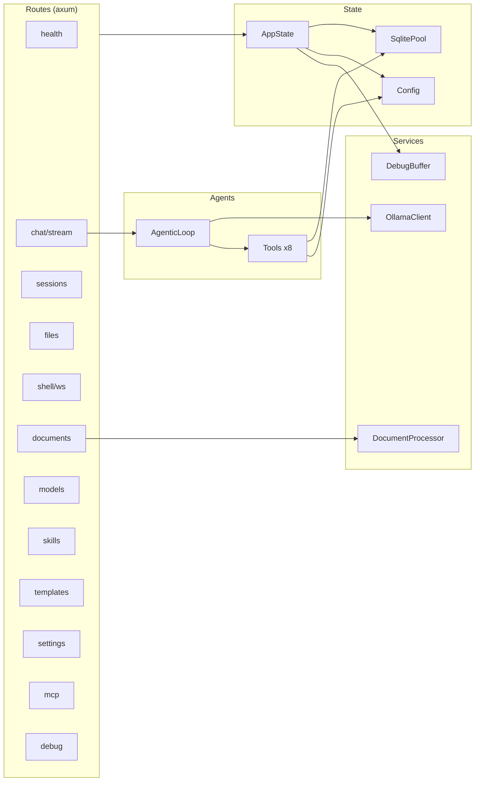
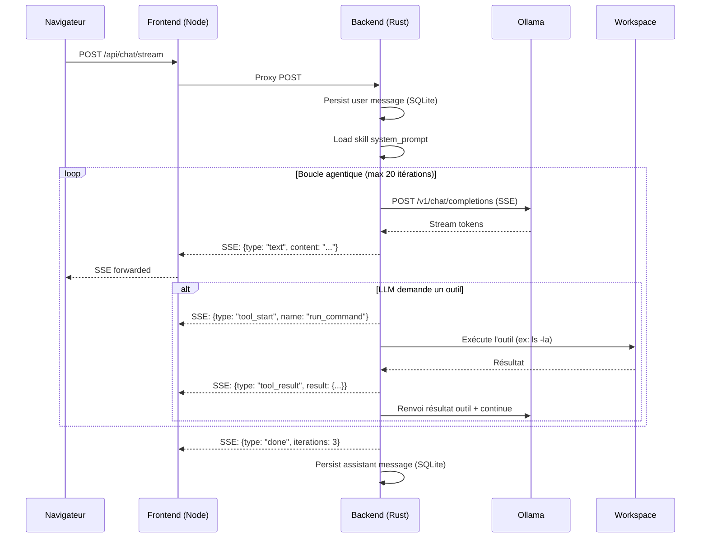
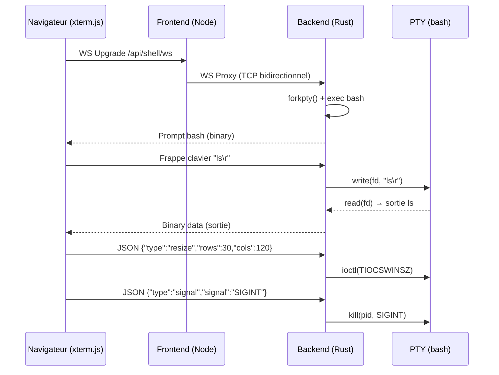
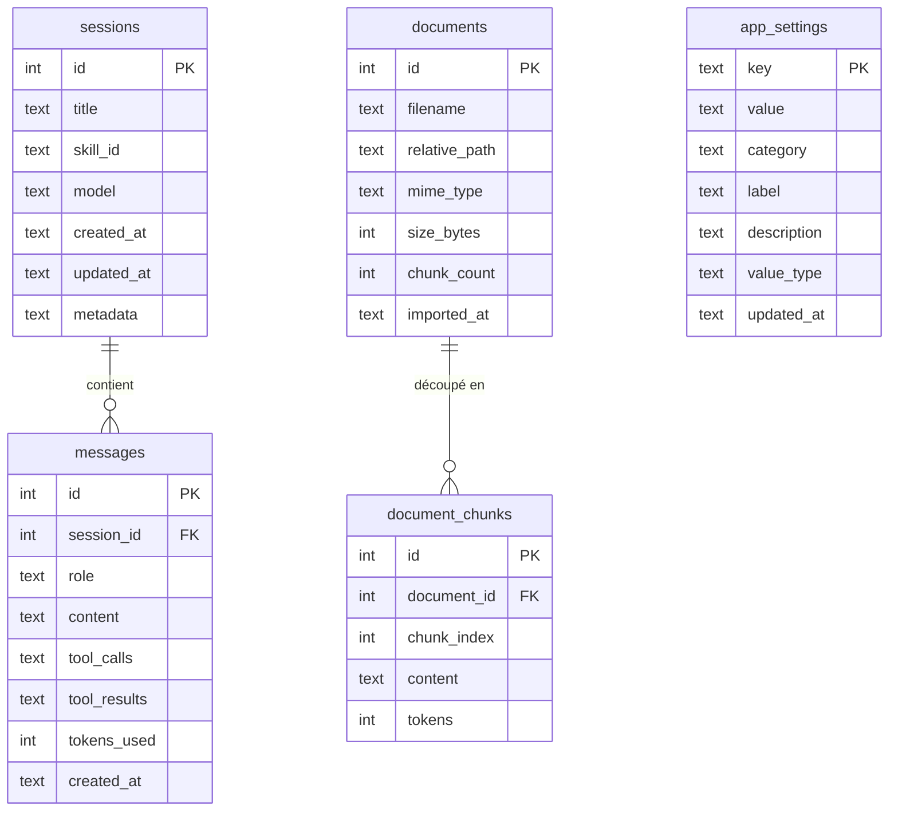

# OllamaStudio — Architecture technique

## Vue d'ensemble



---

## Architecture du backend (Rust)



---

## Flux de données — Chat avec outils



---

## Flux de données — Terminal WebSocket



---

## Modèle de données



---

## Structure du projet

```
ollamastudio/
├── VERSION                          # Version unique (source de vérité)
├── README.md
├── favicon.ico
│
├── backend-rs/                      # Backend Rust (Axum)
│   ├── Cargo.toml
│   ├── build.sh                     # Compile + génère .deb/.rpm
│   ├── run.sh                       # Lancement dev
│   ├── migrations/
│   │   └── 001_init.sql             # Schéma SQLite (5 tables + triggers)
│   └── src/
│       ├── main.rs                  # Point d'entrée, init, serveur
│       ├── config.rs                # Config depuis variables d'env
│       ├── db.rs                    # Pool SQLite + migrations
│       ├── error.rs                 # AppError → HTTP responses
│       ├── state.rs                 # AppState partagé
│       ├── models/
│       │   ├── session.rs
│       │   ├── message.rs
│       │   ├── setting.rs
│       │   ├── skill.rs
│       │   └── template.rs
│       ├── routes/                  # 38 endpoints
│       │   ├── health.rs
│       │   ├── config_route.rs
│       │   ├── chat.rs              # SSE streaming
│       │   ├── sessions.rs
│       │   ├── files.rs
│       │   ├── shell.rs             # WebSocket PTY
│       │   ├── documents.rs
│       │   ├── models.rs
│       │   ├── skills.rs
│       │   ├── templates.rs
│       │   ├── settings.rs
│       │   ├── mcp.rs
│       │   └── debug.rs
│       ├── services/
│       │   ├── ollama.rs            # Client HTTP SSE (OpenAI/Anthropic)
│       │   ├── document_processor.rs
│       │   └── debug.rs             # Ring buffer
│       └── agents/
│           ├── loop.rs              # Boucle agentique (Stream SSE)
│           └── tools.rs             # 8 outils (read, write, run, grep...)
│
├── frontend/                        # Frontend SvelteKit
│   ├── server.js                    # Serveur custom (SSR + WS proxy)
│   ├── svelte.config.js
│   ├── vite.config.ts
│   ├── src/
│   │   ├── app.html
│   │   ├── app.css
│   │   ├── hooks.server.ts          # Proxy HTTP /api/* → backend
│   │   ├── routes/
│   │   │   ├── +layout.svelte
│   │   │   └── +page.svelte
│   │   └── lib/
│   │       ├── api/index.ts          # Client API typé
│   │       ├── stores/index.ts       # Stores Svelte
│   │       └── components/
│   │           ├── TopBar.svelte
│   │           ├── ChatPanel/
│   │           ├── Terminal/
│   │           ├── FileExplorer/
│   │           ├── SkillSelector/
│   │           ├── Settings/
│   │           └── ...
│   └── static/
│       └── favicon.ico
│
├── docs/                            # Documentation
│   ├── 03-Installation.md
│   ├── 04-Exploitation.md
│   ├── 05-Architecture.md
│   └── 06-SBOM.md
│
└── docker-compose.yml               # Déploiement Docker (legacy Python)
```

---

## Stack technique

### Backend

| Composant | Technologie | Rôle |
|-----------|-------------|------|
| Langage | Rust 2024 edition | Performance, sécurité mémoire |
| Framework web | Axum 0.8 | Routing, middleware, extractors |
| Base de données | SQLite via SQLx 0.8 | Persistance async, migrations |
| Client HTTP | reqwest 0.12 | Communication avec Ollama et MCP |
| SSE streaming | axum::response::Sse | Chat en temps réel |
| WebSocket | axum::extract::ws | Terminal interactif |
| PTY | nix (forkpty) + libc | Pseudo-terminal pour shell |
| Sérialisation | serde + serde_json + serde_yaml | JSON/YAML |
| Logging | tracing + tracing-subscriber | Logs structurés |
| Runtime async | Tokio (full features) | I/O async, timers, process |

### Frontend

| Composant | Technologie | Rôle |
|-----------|-------------|------|
| Framework | SvelteKit 2 + Svelte 5 | UI réactive, SSR |
| Terminal | xterm.js 5.5 | Terminal web interactif |
| Éditeur | Monaco Editor | Édition de code |
| Markdown | marked + highlight.js | Rendu des réponses chat |
| Build | Vite 5 | Bundling |
| Runtime | Node.js 22 (adapter-node) | SSR + WS proxy |

---

## Sécurité

### Principes

- **Isolation** : Toutes les opérations fichiers sont restreintes au workspace
- **Path traversal** : `safe_path()` résout et vérifie que le chemin reste dans le workspace
- **Commandes shell** : Timeout configurable, exécution dans le workspace uniquement
- **Pas de données externes** : Aucun envoi vers des serveurs tiers
- **CORS** : Configuré explicitement
- **SQLite** : WAL mode pour la concurrence

### Matrice des risques MITRE ATT&CK

| Technique | ID | Mitigation |
|-----------|-----|-----------|
| Command Injection | T1059 | Timeout strict, workspace isolé |
| Path Traversal | T1083 | `safe_path()` avec `canonicalize()` |
| Arbitrary File Read | T1005 | Validation chemin, taille max |
| Denial of Service | T1499 | Timeout Ollama, max iterations (20) |
