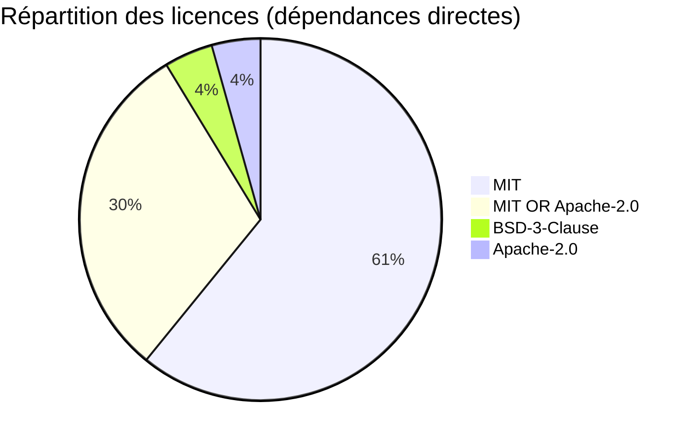

# OllamaStudio — SBOM (Software Bill of Materials)

**Version** : 0.0.15
**Date** : 2026-03-26
**Format** : CycloneDX-like (Markdown)

---

## Informations projet

| Champ | Valeur |
|-------|--------|
| Nom | OllamaStudio |
| Version | 0.0.15 |
| Auteur | GoverByte / Cyrille |
| Repository | https://github.com/cve-solutions/ollamastudio |
| Langages | Rust 2024, TypeScript, Svelte 5 |
| Licence | Proprietary |

---

## Backend Rust — Dépendances directes

| Crate | Version | Licence | Rôle |
|-------|---------|---------|------|
| `tokio` | 1.50 | MIT | Runtime asynchrone |
| `tokio-stream` | 0.1 | MIT | Streams asynchrones |
| `axum` | 0.8 | MIT | Framework web HTTP/WS |
| `tower` | 0.5 | MIT | Middleware abstraction |
| `tower-http` | 0.6 | MIT | CORS, trace middleware |
| `sqlx` | 0.8 | MIT / Apache-2.0 | Accès SQLite asynchrone |
| `reqwest` | 0.12 | MIT / Apache-2.0 | Client HTTP (Ollama, MCP) |
| `serde` | 1.0 | MIT / Apache-2.0 | Sérialisation/Désérialisation |
| `serde_json` | 1.0 | MIT / Apache-2.0 | JSON |
| `serde_yaml` | 0.9 | MIT / Apache-2.0 | YAML (skills, templates) |
| `chrono` | 0.4 | MIT / Apache-2.0 | Date/time |
| `tracing` | 0.1 | MIT | Logging structuré |
| `tracing-subscriber` | 0.3 | MIT | Formatage des logs |
| `nix` | 0.29 | MIT | POSIX (PTY, signaux, ioctl) |
| `libc` | 0.2 | MIT / Apache-2.0 | Bindings C (PTY low-level) |
| `regex` | 1.12 | MIT / Apache-2.0 | Expressions régulières |
| `mime_guess` | 2.0 | MIT | Détection MIME |
| `async-stream` | 0.3 | MIT | Macro stream! pour SSE |
| `futures` | 0.3 | MIT / Apache-2.0 | Traits Future/Stream |

### Dépendances transitives notables

| Crate | Version | Licence | Rôle |
|-------|---------|---------|------|
| `hyper` | 1.x | MIT | Client/serveur HTTP |
| `rustls` | 0.23 | MIT / Apache-2.0 | TLS (pure Rust) |
| `ring` | 0.17 | ISC | Cryptographie |
| `openssl-sys` | 0.9 | MIT | Bindings OpenSSL |
| `h2` | 0.4 | MIT | HTTP/2 |
| `bytes` | 1.x | MIT | Buffer bytes efficace |
| `mio` | 1.x | MIT | I/O asynchrone |
| `pin-project` | 1.x | MIT / Apache-2.0 | Pin projections |

**Total dépendances transitives** : ~569 crates

---

## Frontend Node.js — Dépendances directes

### Dépendances de production

| Package | Version | Licence | Rôle |
|---------|---------|---------|------|
| `@monaco-editor/loader` | ^1.4 | MIT | Chargeur Monaco Editor |
| `@xterm/xterm` | ^5.5 | MIT | Terminal web |
| `@xterm/addon-fit` | ^0.10 | MIT | Auto-resize terminal |
| `@xterm/addon-web-links` | ^0.11 | MIT | Liens cliquables dans terminal |
| `marked` | ^14.0 | MIT | Parser Markdown |
| `highlight.js` | ^11.10 | BSD-3-Clause | Coloration syntaxique |

### Dépendances de développement

| Package | Version | Licence | Rôle |
|---------|---------|---------|------|
| `svelte` | ^5.0 | MIT | Framework UI |
| `@sveltejs/kit` | ^2.7 | MIT | Meta-framework Svelte |
| `@sveltejs/adapter-node` | ^5.2 | MIT | Adapter Node.js |
| `@sveltejs/vite-plugin-svelte` | ^4.0 | MIT | Plugin Vite |
| `vite` | ^5.4 | MIT | Bundler |
| `typescript` | ^5.6 | Apache-2.0 | Typage statique |
| `svelte-check` | ^3.8 | MIT | Vérification types Svelte |
| `tailwindcss` | ^3.4 | MIT | CSS utilitaire |
| `autoprefixer` | ^10.4 | MIT | Préfixes CSS auto |
| `postcss` | ^8.4 | MIT | Transformations CSS |

---

## Dépendances système (runtime)

| Package | Debian/Ubuntu | RHEL/Fedora | Rôle |
|---------|---------------|-------------|------|
| SQLite 3 | `libsqlite3-0` | `sqlite-libs` | Base de données |
| OpenSSL | `libssl3` / `libssl1.1` | `openssl-libs` | TLS |
| glibc | `libc6` | `glibc` | Bibliothèque C standard |
| bash | `bash` | `bash` | Shell pour terminal PTY |
| Node.js 22 | `nodejs` | `nodejs` | Runtime frontend |

---

## Dépendances système (build)

| Package | Debian/Ubuntu | RHEL/Fedora | Rôle |
|---------|---------------|-------------|------|
| Compilateur C | `build-essential` | `gcc`, `make` | Compilation crates natives |
| pkg-config | `pkg-config` | `pkg-config` | Détection des libs |
| SQLite headers | `libsqlite3-dev` | `sqlite-devel` | Compilation sqlx |
| OpenSSL headers | `libssl-dev` | `openssl-devel` | Compilation reqwest |
| Rust toolchain | `rustup` | `rustup` | Compilateur Rust |
| npm | `npm` | `npm` | Build frontend |

---

## Résumé des licences



| Licence | Nombre de dépendances directes | Compatible usage commercial |
|---------|-------------------------------|---------------------------|
| MIT | 14 | Oui |
| MIT OR Apache-2.0 | 7 | Oui |
| BSD-3-Clause | 1 (highlight.js) | Oui |
| Apache-2.0 | 1 (typescript) | Oui |
| ISC | 1 (ring, transitive) | Oui |

**Conclusion** : Toutes les dépendances sont sous licences permissives, compatibles avec un usage commercial et propriétaire.

---

## Outils de vérification

```bash
# Audit des dépendances Rust
cargo audit

# Arbre des dépendances
cargo tree

# Licences (avec cargo-license)
cargo install cargo-license
cargo license

# Audit npm
cd frontend && npm audit
```
